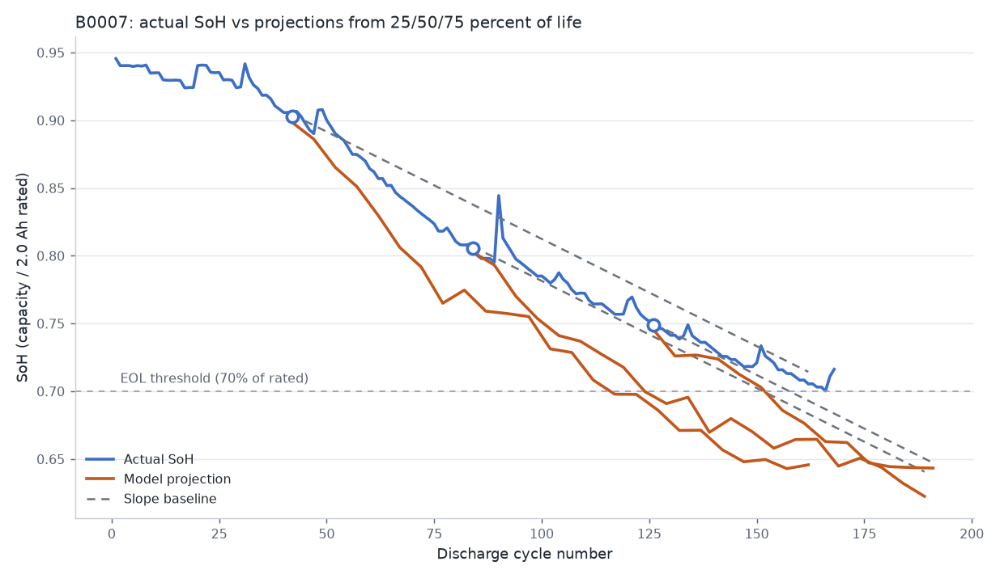
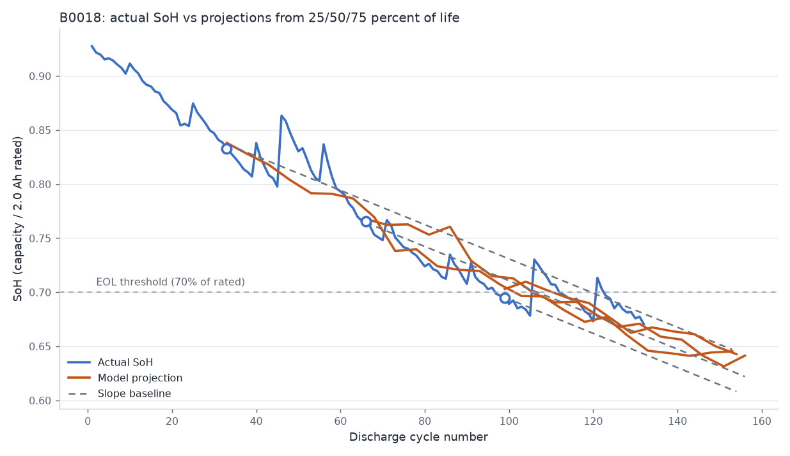

# Results

All numbers are on whole held-out batteries (unit-level split; no battery appears in more than one split -- asserted in code).

## SoH prediction error by horizon (MAE / RMSE in SoH units)

Baselines listed first. The model only claims value where it beats them.

| split | battery_id | horizon | method | mae | rmse |
|---|---|---|---|---|---|
| val | B0007 | 1 | baseline_global_slope | 0.00311 | 0.00606 |
| val | B0007 | 1 | baseline_last_value | 0.00347 | 0.00621 |
| val | B0007 | 1 | lgbm_autoregressive | 0.00513 | 0.00742 |
| val | B0007 | 1 | ridge_autoregressive | 0.01524 | 0.01862 |
| val | B0007 | 1 | lgbm_telemetry | 0.02841 | 0.03160 |
| val | B0007 | 10 | baseline_global_slope | 0.00885 | 0.01163 |
| val | B0007 | 10 | baseline_last_value | 0.01600 | 0.01873 |
| val | B0007 | 10 | lgbm_autoregressive | 0.01705 | 0.01981 |
| val | B0007 | 10 | ridge_autoregressive | 0.02559 | 0.03007 |
| val | B0007 | 10 | lgbm_telemetry | 0.03460 | 0.03835 |
| val | B0007 | 25 | baseline_global_slope | 0.01424 | 0.01750 |
| val | B0007 | 25 | lgbm_autoregressive | 0.03259 | 0.03489 |
| val | B0007 | 25 | baseline_last_value | 0.03851 | 0.04226 |
| val | B0007 | 25 | ridge_autoregressive | 0.04675 | 0.05086 |
| val | B0007 | 25 | lgbm_telemetry | 0.04686 | 0.05051 |
| val | B0007 | 50 | baseline_global_slope | 0.01893 | 0.02212 |
| val | B0007 | 50 | lgbm_autoregressive | 0.04965 | 0.05043 |
| val | B0007 | 50 | lgbm_telemetry | 0.06293 | 0.06480 |
| val | B0007 | 50 | baseline_last_value | 0.08260 | 0.08544 |
| val | B0007 | 50 | ridge_autoregressive | 0.09162 | 0.09416 |
| test | B0018 | 1 | baseline_global_slope | 0.00605 | 0.01114 |
| test | B0018 | 1 | baseline_last_value | 0.00708 | 0.01130 |
| test | B0018 | 1 | lgbm_autoregressive | 0.00883 | 0.01216 |
| test | B0018 | 1 | ridge_autoregressive | 0.01375 | 0.01557 |
| test | B0018 | 1 | lgbm_telemetry | 0.03184 | 0.03741 |
| test | B0018 | 10 | baseline_global_slope | 0.01784 | 0.02194 |
| test | B0018 | 10 | lgbm_autoregressive | 0.01965 | 0.02368 |
| test | B0018 | 10 | ridge_autoregressive | 0.02441 | 0.02724 |
| test | B0018 | 10 | baseline_last_value | 0.02512 | 0.02881 |
| test | B0018 | 10 | lgbm_telemetry | 0.03462 | 0.04029 |
| test | B0018 | 25 | lgbm_autoregressive | 0.01923 | 0.02325 |
| test | B0018 | 25 | baseline_global_slope | 0.02586 | 0.03066 |
| test | B0018 | 25 | ridge_autoregressive | 0.02991 | 0.03448 |
| test | B0018 | 25 | lgbm_telemetry | 0.03439 | 0.03921 |
| test | B0018 | 25 | baseline_last_value | 0.04741 | 0.05558 |
| test | B0018 | 50 | lgbm_autoregressive | 0.01261 | 0.01554 |
| test | B0018 | 50 | lgbm_telemetry | 0.01790 | 0.02181 |
| test | B0018 | 50 | baseline_global_slope | 0.02952 | 0.03483 |
| test | B0018 | 50 | ridge_autoregressive | 0.02963 | 0.03603 |
| test | B0018 | 50 | baseline_last_value | 0.09962 | 0.10353 |

## RUL error (cycles)

Derived by projecting the SoH trajectory to the EOL crossing; reported separately from SoH because it is the harder, higher-variance task. B0007 never crosses the 70 percent threshold in its observed life (right-censored), so it is only evaluable at the 80 percent sensitivity threshold.

| battery_id | threshold | method | n_points | n_censored_preds | rul_mae_cycles | rul_median_ae_cycles | rul_max_ae_cycles |
|---|---|---|---|---|---|---|---|
| B0007 | 0.80 | global_slope | 77 | 0 | 15.55 | 17.28 | 34.57 |
| B0007 | 0.80 | lgbm_trajectory | 77 | 0 | 13.48 | 14.20 | 22.90 |
| B0018 | 0.70 | global_slope | 88 | 0 | 19.84 | 18.34 | 52.23 |
| B0018 | 0.70 | lgbm_trajectory | 88 | 0 | 9.97 | 9.84 | 18.10 |
| B0018 | 0.80 | global_slope | 36 | 0 | 16.37 | 16.46 | 35.49 |
| B0018 | 0.80 | lgbm_trajectory | 36 | 0 | 9.80 | 8.74 | 22.65 |

## Input drift (PSI, train vs held-out battery)

PSI < 0.1 stable, 0.1-0.25 moderate, > 0.25 significant. Held-out batteries SHOULD show shift on age-linked features -- they are different physical cells; this table demonstrates the monitoring hook, not a deployment alarm.

| compared_to_train | feature | psi | rating |
|---|---|---|---|
| val B0007 | voltage_min_prev | 5.966 | significant shift |
| val B0007 | temp_max_prev | 2.604 | significant shift |
| val B0007 | discharge_duration_prev | 2.383 | significant shift |
| val B0007 | ambient_temperature | 2.152 | significant shift |
| val B0007 | charge_current_end | 2.045 | significant shift |
| val B0007 | charge_temp_max | 1.896 | significant shift |
| val B0007 | time_since_prev_cycle_h | 1.536 | significant shift |
| val B0007 | soh_roll_mean | 1.402 | significant shift |
| val B0007 | soh_prev | 1.283 | significant shift |
| val B0007 | soh_roll_std | 1.127 | significant shift |
| val B0007 | charge_duration_s | 1.046 | significant shift |
| val B0007 | fade_rate | 0.533 | significant shift |
| val B0007 | cycle_index | 0.497 | significant shift |
| test B0018 | charge_temp_max | 6.981 | significant shift |
| test B0018 | temp_max_prev | 6.361 | significant shift |
| test B0018 | time_since_prev_cycle_h | 6.106 | significant shift |
| test B0018 | voltage_min_prev | 3.941 | significant shift |
| test B0018 | discharge_duration_prev | 3.118 | significant shift |
| test B0018 | ambient_temperature | 2.152 | significant shift |
| test B0018 | soh_roll_mean | 1.438 | significant shift |
| test B0018 | soh_prev | 1.395 | significant shift |
| test B0018 | charge_duration_s | 1.338 | significant shift |
| test B0018 | cycle_index | 1.173 | significant shift |
| test B0018 | soh_roll_std | 0.483 | significant shift |
| test B0018 | fade_rate | 0.318 | significant shift |
| test B0018 | charge_current_end | 0.243 | moderate shift |

## Figures

